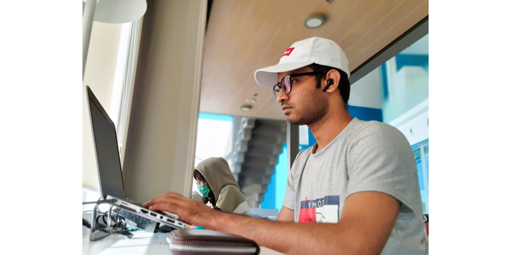

  

### Hi there 👋

I'm Samuel Akram, a self taught Junior Mobile Developer from Karachi/Pakistan. I have been working in the office as Program Coordinator for the past decade, but my passion is programming and developing applications so therefore I am working towards switching careers. 

- 🌱 I’m currently learning Kotlin, Dart, Java.
- 💬 I can develop Mid level applications & implement Android's recent technologies.
- 📫 How to reach me: dev.samakram@gmail.com

### Skills

  
  
  

 

### Recent Projects

- [Chat Messenger - Kotlin](https://github.com/developersamuelakram/ChatMessenger)

### Connect with me

  
  
  
  

 
 
